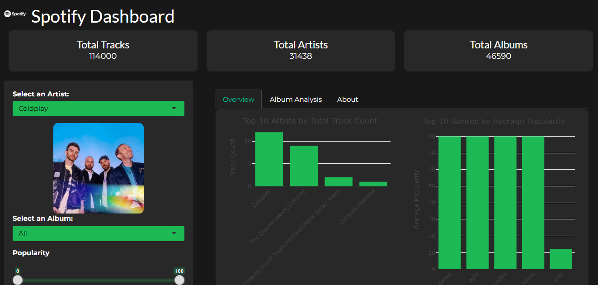

# Spotify Music Dashboard



## Overview
An interactive data visualization dashboard for exploring Spotify music data, built with R Shiny. This application allows users to analyze relationships between songs' audio features (like danceability, energy, and tempo) and their popularity.

## Live Demo
[Try the Spotify Dashboard](https://spotify-dashboard.shinyapps.io/spotify-dashboard/)

## Features
- Filter music by artist, album, and various audio features
- Interactive visualizations showing relationships between audio features and popularity
- View album details and track listings with links to Spotify
- Analyze trends in music characteristics across different artists and genres
- Responsive design styled to match Spotify's aesthetic

## Technology
- **R/Shiny**: Framework for interactive web applications
- **Plotly**: Advanced interactive visualizations
- **Spotify Web API**: Real-time artist and album information
- **dplyr**: Data manipulation and analysis
- **CSS**: Custom styling to match Spotify's visual identity

## Dataset
The dashboard uses a dataset of 114,000 tracks with information about:
- Track and artist details
- Audio features (danceability, energy, tempo, valence, etc.)
- Popularity metrics and genre classifications

## Local Development

### Prerequisites
- R and RStudio
- Required packages: shiny, httr, jsonlite, dplyr, readr, plotly, shinycssloaders, shinythemes

### Setup
1. Clone this repository
2. Create a Spotify Developer account and get API credentials
3. Set up your credentials as environment variables:
```r
Sys.setenv(SPOTIFY_CLIENT_ID="your_client_id")
Sys.setenv(SPOTIFY_CLIENT_SECRET="your_client_secret")
